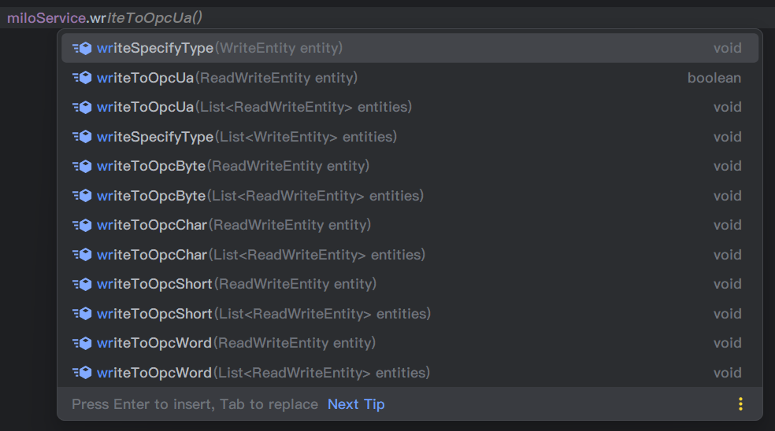

# milo-spring-boot-starter

milo 封装工具包，yml配置OPC UA地址，是否匿名等信息，即可连接OPC UA服务器

## 配置
```yaml
kangaroohy:
  milo:
    endpoint: opc.tcp://127.0.0.1:49320
    security-policy: none
```

```yaml
kangaroohy:
  milo:
    endpoint: opc.tcp://127.0.0.1:49320
    security-policy: basic256sha256
    username: OPCUA
    password: 123456
```

特别提醒：

在kepware中，用户名/密码访问时，opcua配置，安全策略中三个策略全部勾选

同时kepware选项属性中的OPC UA配置，不允许匿名访问

此时，security-policy可选值：basic256sha256，basic256，basic128rsa15都可

同时配置上 用户名/密码 即可访问服务器

## 连接池

此封装自带了连接池配置，默认会生成3个连接，可配置

~~~yaml
kangaroohy:
  milo:
    pool:
      max-idle: 5
      max-total: 20
      min-idle: 2
      initial-size: 3
~~~

## 写
注入MiloService即可使用，支持：批量读、单个写（批量写，循环即可）、批量订阅（订阅不好使，推荐kepware使用MQTT实现订阅功能）

其中：写值是可能需要指定数据类型，视点位情况而定

Opc后边的字段对应Kepware中的tag数据类型（Ua除外，为通用类型）



### 通用类型

如Kep类型为：Boolean、LLong、Long、String、Float、Double，调用方法：`miloService.writeToOpcUa(ReadWriteEntity entity)`

```java
@SpringBootTest
@RunWith(SpringRunner.class)
public class MiloTest {
    @Autowired
    MiloService miloService;
    
    @Test
    public void writeToOpcUa() {
        miloService.writeToOpcUa(
                ReadWriteEntity.builder()
                        .identifier("GA.T1.Boolean")
                        //Kep中是Boolean类型
                        .value(true)
                        .build());
        miloService.writeToOpcUa(
                ReadWriteEntity.builder()
                        .identifier("GA.T1.LLong")
                        //Kep中是LLong类型，即：Int64，Java中的Long类型
                        .value(1235468L)
                        .build());
        miloService.writeToOpcUa(
                ReadWriteEntity.builder()
                        .identifier("GA.T1.Long")
                        //Kep中是Long类型，即：Int32，Java中的int类型
                        .value(123456)
                        .build());
        miloService.writeToOpcUa(
                ReadWriteEntity.builder()
                        .identifier("GA.T1.String")
                        .value("字符串")
                        .build());
        miloService.writeToOpcUa(
                ReadWriteEntity.builder()
                        .identifier("GA.T1.Float")
                        //Kep中是Float类型
                        .value(123.123F)
                        .build());
        miloService.writeToOpcUa(
                ReadWriteEntity.builder()
                        .identifier("GA.T1.Double")
                        //Kep中是Double类型
                        .value(123.123)
                        .build());
    }
}
```

### 已提供方法的类型

如Kep类型为：Short、Word、Byte、Char，调用方法：`miloService.writeToOpcXXX(ReadWriteEntity entity)`，XXX对应kep类型

```java
@SpringBootTest
@RunWith(SpringRunner.class)
public class MiloTest {
    @Autowired
    MiloService miloService;

    @Test
    public void writeToOpcUa() {
        miloService.writeToOpcShort(
                ReadWriteEntity.builder()
                        .identifier("GA.T1.Short")
                        //Kep中是Short类型，即：Int16，带符号整数
                        .value(-123)
                        .build());
        miloService.writeToOpcWord(
                ReadWriteEntity.builder()
                        .identifier("GA.T1.Word")
                        //Kep中是Word类型，即：UInt16，无符号整数
                        .value(123)
                        .build());
        miloService.writeToOpcByte(
                ReadWriteEntity.builder()
                        .identifier("GA.BIT_8.Byte")
                        //Kep中是Byte类型，8位无符号整数
                        .value(123)
                        .build());
        miloService.writeToOpcChar(
                ReadWriteEntity.builder()
                        .identifier("GA.BIT_8.Char")
                        //Kep中是Char类型，8位带符号整数
                        .value(-123)
                        .build());
    }
}
```

### 其他类型

其他的数据类型，则需要调用方法：`miloService.writeSpecifyType(WriteEntity entity)`，自行指定转换类型.variant(new Variant(xxx))

new Variant(xxx)：
> new Variant(String[])
> 
> new Variant(Unsigned.ushort("123"))
> 
> ....

参数类型具体以标签数据类型为准，列如：

```java
@SpringBootTest
@RunWith(SpringRunner.class)
public class MiloTest {
    @Autowired
    MiloService miloService;

    @Test
    public void writeToOpcUa() {
        UByte[] bytes = new UByte[10];
        bytes[0] = UByte.valueOf(1);
        bytes[1] = UByte.valueOf(2);
        bytes[2] = UByte.valueOf(3);
        bytes[3] = UByte.valueOf(4);

        miloService.writeSpecifyType(
                WriteEntity.builder()
                        .identifier("GA.BIT_8.Bytes")
                        //Kep中是Byte Array类型
                        .variant(new Variant(bytes))
                        .build());
    }
}
```

## 读


读比较简单，传相应的TAG id数组即可，调用方法：readFromOpcUa(List<String> ids)

id格式：通道名.设备名.TAG

如：GA.T1.T1001R_1

## 遍历节点


可遍历指定节点相关信息