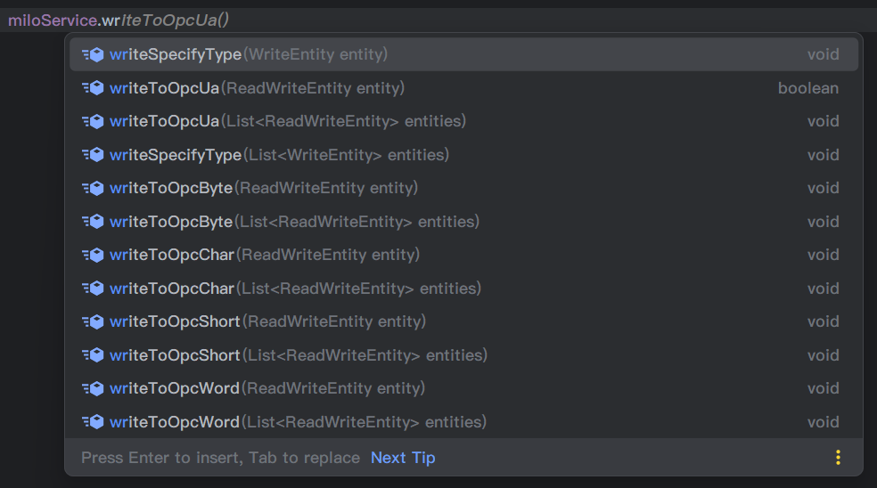
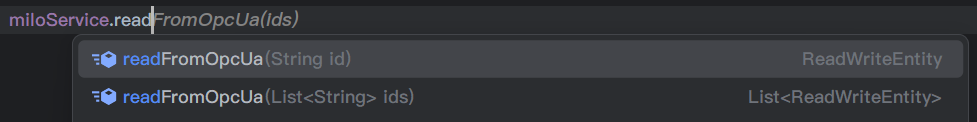
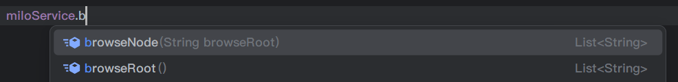

# milo-spring-boot-starter

milo 封装工具包，yml配置OPC UA地址，是否匿名等信息，即可连接OPC UA服务器

## maven

[](https://search.maven.org/#search%7Cgav%7C1%7Cg%3A%22com.kangaroohy%22%20AND%20a%3A%milo-spring-boot-starter%22)

首次版本发布，适配 spring boot 3.x，也可在spring boot 2.x中使用

~~~
<dependency>
    <groupId>com.kangaroohy</groupId>
    <artifactId>milo-spring-boot-starter</artifactId>
    <version>${lastVersion}</version>
</dependency>
~~~

## 配置
```yaml
kangaroohy:
  milo:
    primary: default
    config:
      default:
          endpoint: opc.tcp://127.0.0.1:49320
          security-policy: none
```

```yaml
kangaroohy:
  milo:
    primary: default
    config:
      default:
        endpoint: opc.tcp://127.0.0.1:49320
        security-policy: basic256sha256
        # 可选：none / sign / sign-and-encrypt；不填则使用匹配策略的第一个 Endpoint
        security-mode: sign-and-encrypt
        username: OPCUA
        password: 123456
      test:
        endpoint: opc.tcp://127.0.0.1:49321
        security-policy: basic256sha256
        username: OPCUA
        password: 123456
```

## 连接

每个配置的 OPC UA endpoint 只维护一个长期客户端连接。读、写和订阅共享该
客户端；OPC UA 客户端本身支持多路复用，不再使用连接池，也不会为每个点位
创建连接。

批量读取会自动按批次拆分，默认每批 200 个点位，避免超过服务端的
`MaxNodesPerRead` 或消息大小限制；可按服务端能力调整：

```yaml
kangaroohy:
  milo:
    read-batch-size: 200
    write-batch-size: 200
    subscription-batch-size: 200
    request-timeout: 5000
    subscription-queue-size: 10
    callback-threads: 2
    callback-queue-capacity: 10000
```

读写和创建监控项都会按批次拆分。每个批次独立请求；读取时某个批次超时或通信
失败，该批次的点位返回对应的坏状态码，其余批次仍会继续执行。写入会先完成
其余批次，最后汇总失败状态并抛出异常。回调线程按点位分配到单线程队列，同一
点位的回调保持顺序；队列达到容量后会形成背压。

订阅统一通过 `MiloService.subscriptionFromOpcUa(...)` 创建，以复用同一 endpoint
下的服务端 Subscription 和统一回调线程池。

## 写

注入MiloService即可使用，支持：批量读、单个写（批量写，循环即可）

其中：写值时可能需要指定数据类型，视点位情况而定

Opc后边的字段对应Kepware中的tag数据类型（Ua除外，为通用类型）



### 通用类型

如Kep类型为：Boolean、LLong、Long、String、Float、Double，调用方法：`miloService.writeToOpcUa(ReadWriteEntity entity)`

```java
@SpringBootTest
@RunWith(SpringRunner.class)
public class MiloTest {
    @Autowired
    MiloService miloService;
    
    @Test
    public void writeToOpcUa() {
        miloService.writeToOpcUa(
                ReadWriteEntity.builder()
                        .identifier("GA.T1.Boolean")
                        //Kep中是Boolean类型
                        .value(true)
                        .build());
        miloService.writeToOpcUa(
                ReadWriteEntity.builder()
                        .identifier("GA.T1.LLong")
                        //Kep中是LLong类型，即：Int64，Java中的Long类型
                        .value(1235468L)
                        .build());
        miloService.writeToOpcUa(
                ReadWriteEntity.builder()
                        .identifier("GA.T1.Long")
                        //Kep中是Long类型，即：Int32，Java中的int类型
                        .value(123456)
                        .build());
        miloService.writeToOpcUa(
                ReadWriteEntity.builder()
                        .identifier("GA.T1.String")
                        .value("字符串")
                        .build());
        miloService.writeToOpcUa(
                ReadWriteEntity.builder()
                        .identifier("GA.T1.Float")
                        //Kep中是Float类型
                        .value(123.123F)
                        .build());
        miloService.writeToOpcUa(
                ReadWriteEntity.builder()
                        .identifier("GA.T1.Double")
                        //Kep中是Double类型
                        .value(123.123)
                        .build());
    }
}
```

### 已提供方法的类型

如Kep类型为：Short、Word、Byte、Char，调用方法：`miloService.writeToOpcXXX(ReadWriteEntity entity)`，XXX对应kep类型

```java
@SpringBootTest
@RunWith(SpringRunner.class)
public class MiloTest {
    @Autowired
    MiloService miloService;

    @Test
    public void writeToOpcUa() {
        miloService.writeToOpcShort(
                ReadWriteEntity.builder()
                        .identifier("GA.T1.Short")
                        //Kep中是Short类型，即：Int16，带符号整数
                        .value(-123)
                        .build());
        miloService.writeToOpcWord(
                ReadWriteEntity.builder()
                        .identifier("GA.T1.Word")
                        //Kep中是Word类型，即：UInt16，无符号整数
                        .value(123)
                        .build());
        miloService.writeToOpcByte(
                ReadWriteEntity.builder()
                        .identifier("GA.BIT_8.Byte")
                        //Kep中是Byte类型，8位无符号整数
                        .value(123)
                        .build());
        miloService.writeToOpcChar(
                ReadWriteEntity.builder()
                        .identifier("GA.BIT_8.Char")
                        //Kep中是Char类型，8位带符号整数
                        .value(-123)
                        .build());
    }
}
```

### 其他类型

其他的数据类型，则需要调用方法：`miloService.writeSpecifyType(WriteEntity entity)`，自行指定转换类型.variant(new Variant(xxx))

new Variant(xxx)：
> new Variant(String[])
> 
> new Variant(Unsigned.ushort("123"))
> 
> ....

参数类型具体以标签数据类型为准，例如：

```java
@SpringBootTest
@RunWith(SpringRunner.class)
public class MiloTest {
    @Autowired
    MiloService miloService;

    @Test
    public void writeToOpcUa() {
        UByte[] bytes = new UByte[10];
        bytes[0] = UByte.valueOf(1);
        bytes[1] = UByte.valueOf(2);
        bytes[2] = UByte.valueOf(3);
        bytes[3] = UByte.valueOf(4);

        miloService.writeSpecifyType(
                WriteEntity.builder()
                        .identifier("GA.BIT_8.Bytes")
                        //Kep中是Byte Array类型
                        .variant(new Variant(bytes))
                        .build());
    }
}
```

## 读



读比较简单，传相应的TAG id数组即可，调用方法：readFromOpcUa(List<String> ids)

id格式：通道名.设备名.TAG

如：GA.T1.T1001R_1

## 遍历节点



可遍历指定节点相关信息

## 订阅

这里使用的是实现`ApplicationRunner`接口，实现在项目启动时，自动订阅相关点位

当点位数值发生改变，则会触发回调，根据回调即可实现相应的逻辑

> 同一个 endpoint 的订阅会复用客户端连接，并按发布周期复用服务端 Subscription。
> `subscriptionFromOpcUa` 会立即返回 `SubscriptionHandle`，不再阻塞调用线程；
> 不需要订阅时调用 `handle.close()` 删除监控项。

~~~java
@Component
@Slf4j
public class CustomRunner implements ApplicationRunner {

    @Autowired
    private MiloService miloService;

    @Override
    public void run(ApplicationArguments args) throws Exception {
        sub();
    }

    private void sub() throws Exception {
        List<String> ids = new ArrayList<>();
        ids.add("GA.T1.T1001R");
        ids.add("GA.T1.String");
        SubscriptionHandle handle = miloService.subscriptionFromOpcUa(ids,
                (item, value) -> log.info("subscription 点位：{} 订阅到消息：{}", item.getNodeId(), value));
    }
}
~~~

## 数据库动态加载连接

实现`MiloConfigProvider`，`@Component` 给spring管理即可

~~~java
@Component
public class MiloProvider implements MiloConfigProvider {
    @Override
    public Map<String, MiloProperties.Config> config() {
        Map<String, MiloProperties.Config> configMap = new HashMap<>();
        MiloProperties.Config config = new MiloProperties.Config();
        config.setEndpoint("opc.tcp://192.168.68.134:49320");
        config.setSecurityPolicy(SecurityPolicy.Basic256);
        config.setUsername("OPCUA");
        config.setPassword("123456");
        configMap.put("dbConfig", config);
        return configMap;
    }
}
~~~

## Milo 连接 KepServer 注意事项

### Endpoint 与安全配置

KepServer Endpoint 配置示例：

```yaml
kangaroohy:
  milo:
    primary: kepserver
    config:
      kepserver:
        endpoint: opc.tcp://192.168.68.68:49320
        security-policy: basic256
        security-mode: sign-and-encrypt
        username: OPCUA
        password: 123456
```

`security-policy` 必须是 KepServer Endpoint 已启用的安全策略，
`security-mode` 必须是该策略支持的消息安全模式：

| KepServer 配置 | Milo 配置 |
| --- | --- |
| None | `security-policy: none`、`security-mode: none` |
| Basic128Rsa15 + 签名 | `basic128rsa15`、`sign` |
| Basic128Rsa15 + 签名与加密 | `basic128rsa15`、`sign-and-encrypt` |
| Basic256 + 签名 | `basic256`、`sign` |
| Basic256 + 签名与加密 | `basic256`、`sign-and-encrypt` |
| Basic256Sha256 + 签名与加密 | `basic256sha256`、`sign-and-encrypt` |

不配置 `security-mode` 时，会在相同 `security-policy` 的 Endpoint 中选择第一个，
生产环境建议明确配置，避免 KepServer 同时开放 `Sign` 和 `SignAndEncrypt` 时选错。
`Basic128Rsa15` 和 `Basic256` 已属于兼容性安全策略；如果 KepServer 版本支持，
优先使用 `Basic256Sha256 + SignAndEncrypt`。`None + None` 不建议在生产环境使用。

用户名/密码与安全策略是两个不同层面的配置。KepServer 禁止匿名访问时必须配置
`username` 和 `password`；允许匿名访问时可以不配置。如果 `None + None` 可以连接，
但安全 Endpoint 无法连接，应优先检查证书，而不是账号密码。

### 双向证书信任

使用非 `None` 安全策略时，Milo 和 KepServer 必须互相信任证书。Milo 首次连接会在
当前 Java 进程的用户目录下生成：

```text
~/.milo-security/milo-client.pfx
~/.milo-security/pki/
```

先发起一次连接，再打开 KepServer 的 **OPC UA Configuration Manager → 受信任的客户端**。
找到 URI 为 `urn:kangaroohy:milo:client` 的 `Milo Client`：如果图标带红叉，说明
证书只是被 KepServer 发现但仍处于拒绝状态，需要选中它并点击“信任”。保存后按照
KepServer 窗口底部提示重新初始化 Server Runtime。

KepServer 服务端证书第一次通常会进入 Milo 的拒绝目录：

```text
~/.milo-security/pki/rejected/
```

确认它确实是目标 KepServer 的证书后，将 `.der` 证书移动到：

```text
~/.milo-security/pki/trusted/certs/
```

然后重启应用。若应用由 Docker、systemd、IDE 或其他系统用户启动，`~` 指向的是
该 Java 进程的 `user.home`，不一定是当前登录用户目录。可根据启动日志中的
`security temp dir` 确认实际证书目录。同名证书也可能是旧证书，应通过指纹确认，
不要只比较证书名称或 URI。

### 内网穿透和域名代理

通过内网穿透访问时，`endpoint` 填写客户端实际可达的公网域名和端口，例如：

```yaml
endpoint: opc.tcp://opc.example.com:149320
security-policy: basic256
security-mode: sign-and-encrypt
```

KepServer 的 GetEndpoints 响应可能仍返回内网 IP。组件会先按安全策略和可选的安全
模式选择 Endpoint，再将返回地址改写为配置中的域名和端口，因此不会仅因域名与
内网 IP 不一致而过滤失败。

### 点位与订阅地址

简写点位地址时，组件默认按 namespace 2 解析：

```text
通道名.设备名.TAG名
```

等价于：

```text
ns=2;s=通道名.设备名.TAG名
```

如果 KepServer 中点位不属于 namespace 2，必须传完整 NodeId，例如
`ns=3;s=Channel1.Device1.Tag1`。订阅地址不存在时，连接和证书仍可能完全正常，
但监控项创建会返回坏状态码。建议先通过 UaExpert 或 `browseRoot`、`browseNode`
确认实际 NodeId，再用于读取、写入和订阅。

常见错误可按下面顺序排查：

| 错误或现象 | 优先检查 |
| --- | --- |
| 找不到期望的 Endpoint | `security-policy`、`security-mode` 是否在 KepServer 中启用 |
| `Bad_SecurityChecksFailed` | KepServer 是否真正信任客户端证书，红叉是否消失 |
| `Bad_CertificateUntrusted` | KepServer 服务端证书是否放入 Milo 的 trusted 目录 |
| `Bad_UserAccessDenied` | KepServer 用户名、密码和匿名访问设置 |
| 连接成功但订阅失败 | NodeId、namespace、通道/设备/TAG 名称是否真实存在 |

## Star History

<p align="center">
  <a href="https://www.star-history.com/kangaroo1122/milo-spring-boot-starter">
    <picture>
      <source media="(prefers-color-scheme: dark)" srcset="https://api.star-history.com/chart?repos=kangaroo1122/milo-spring-boot-starter&type=date&theme=dark&legend=top-left" />
      <source media="(prefers-color-scheme: light)" srcset="https://api.star-history.com/chart?repos=kangaroo1122/milo-spring-boot-starter&type=date&legend=top-left" />
      
    </picture>
  </a>
</p>
