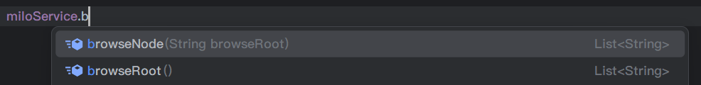
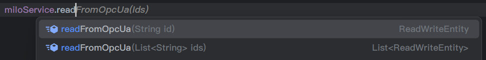
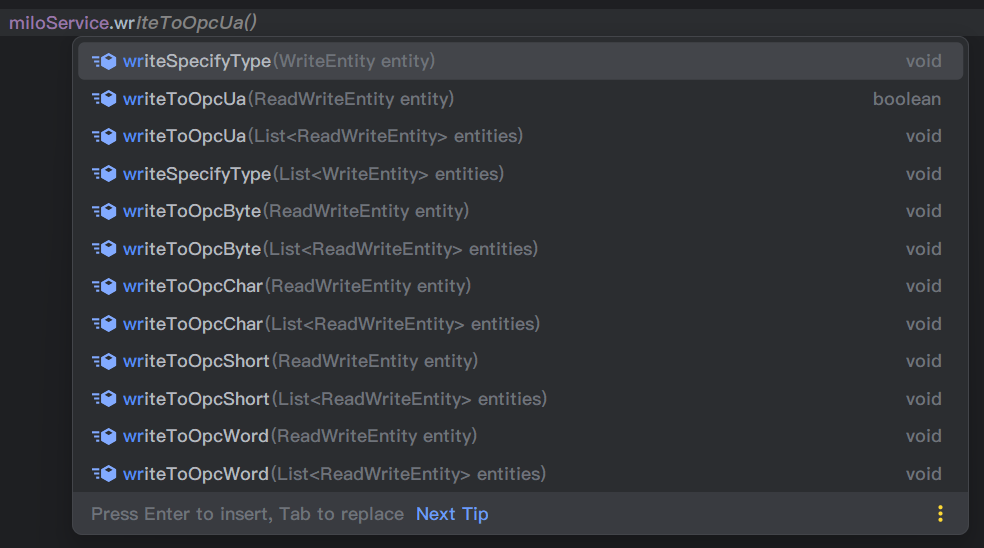

## 3.1.3.0.6.15

- 支持代码加载连接，实现`MiloConfigProvider`，`@Component` 给spring管理即可

## 3.1.2.0.6.15

- 升级到最新版本 0.6.15
- 修复长时间运行导致缓存文件过多的问题
- `readFromOpcUa` 读取数值时支持设置超时时间，默认 `10000ms`

## 3.1.1.0.6.13

- 读值支持返回更多信息 [#PR16](https://github.com/kangaroo1122/milo-spring-boot-starter/pull/16)

## 3.1.0.6.13

- 升级到最新版本 0.6.13
- 修改订阅监听callback参数以获取更多信息，具有破坏性！！！[#PR15](https://github.com/kangaroo1122/milo-spring-boot-starter/pull/15)

## 3.0.6.12

- 升级到最新版本 0.6.12
- 连接池配置优化 [#gitee I86XSX](https://gitee.com/vampire001/milo-spring-boot-starter/issues/I86XSX)

## 3.0.5

- 支持配置是否启用组件：`kangaroohy.milo.enabled=true`

## 3.0.4

- 支持配置多个 opc ua 服务器，调用方法时可手动指定需要访问的服务器
- 批量读值方法优化
- 升级milo依赖到 0.6.10

## 3.0.3

- ID支持字符串表示法：ns=<命名空间索引>;<标识符类型>=<标识符>

## 3.0.2 

- 订阅时 支持指定订阅时间间隙，默认 1000ms

## 3.0.1

- endpoint 支持外网穿透类的地址
- 新增点位订阅方法，订阅断掉自动重连

> 外网穿透类地址如：
> - 内网地址为：opc.tcp://192.168.68.128:49320
> - 外网地址为：opc.tcp://opc.kangaroohy.com:59320

## 3.0.0

- 适配 spring boot 3.x，也可在spring boot 2.x中使用
- 基于 eclipse milo 最新版本 0.6.9
- 支持连接池配置
- 首次封装，提供以下方法

